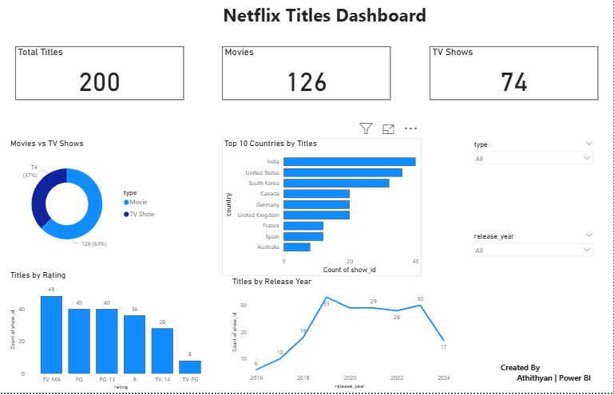

# Power BI Dashboards – Athithyan A
# Netflix Titles Dashboard

## Overview
This dashboard analyzes Netflix titles dataset and provides insights on:
- Total Titles
- Movies vs TV Shows
- Titles by Rating
- Top 10 Countries by Titles
- Titles Trend by Release Year

## Tools Used
- Power BI
- CSV Dataset

## How to Use
1. Download the .pbix file
2. Open it in Power BI Desktop
3. If prompted, load the dataset netflix_titles.csv
4. Refresh the report

## Dashboard Preview

